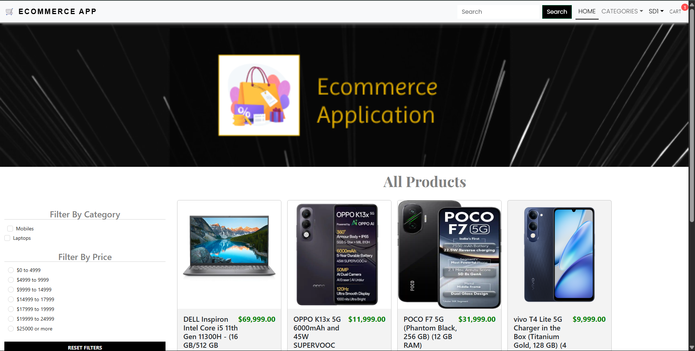
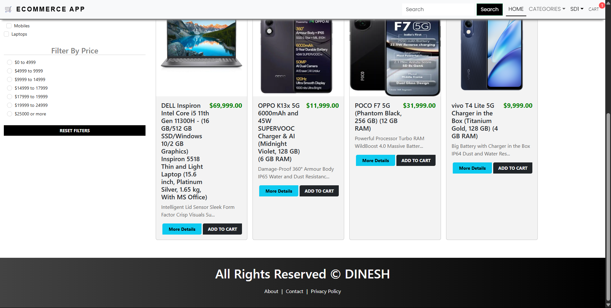

# 🛒 Full-Stack Ecommerce Web Application

A complete **MERN (MongoDB, Express, React, Node.js)** based Ecommerce platform with secure authentication, product management, cart functionality, payment integration, and an admin dashboard.

## ⚙️ Tech Stack

### Frontend
- React.js (with React Router)
- Bootstrap / Custom CSS
- Axios (for API calls)

### Backend
- Node.js + Express.js
- MongoDB + Mongoose
- Braintree (Payment Gateway)
- JWT (Authentication)
- dotenv (Environment configs)

---

## ✨ Features

### ✅ User Features
- Register & Login (JWT-based)
- Browse & Search Products
- Filter by Price & Category
- Add to Cart and Checkout
- Secure Payment with Braintree

### ✅ Admin Features
- Admin Dashboard
- Create/Update/Delete Products
- Manage Categories
- View Orders

---

## 📸 UI Screenshots

### 🖼 Full UI Preview

